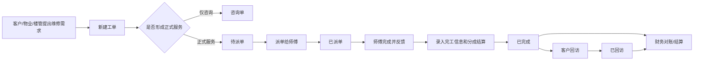

# 乐修匠社区维修管理系统需求规格说明书 V4.0

> 文档版本：V4.0  
> 编写日期：2026-05-22  
> 适用系统：乐修匠社区维修管理系统  
> 适用范围：当前 Web 管理端、后端 API、SQLite 本地数据模型，以及后续 UI 打磨和功能迭代  
> 文档状态：当前需求基线版  

---

## 0. 文档说明

### 0.1 编写目的

本文档用于沉淀“乐修匠社区维修管理系统”的完整产品需求，作为后续开发、测试、验收、UI 打磨、业务讨论和人员交接的统一依据。

本文档重点覆盖以下内容：

- 系统整体定位与业务边界。
- 当前保留和删除的功能模块。
- 工单从客户来电到派单、完工、费用录入、回访、财务对账的完整流程。
- 公司、师傅、物业、楼管四方分成模型。
- 来源渠道细分为客户、普通渠道、具体物业、具体楼管后的筛选和对账要求。
- 财务对账、物业结算、楼管结算、师傅结算的功能口径。
- 系统设置中基础数据、物业档案、楼管档案、用户管理的需求。
- 后端接口、数据模型、字段口径、计算公式、测试验收标准。

### 0.2 当前系统功能边界

当前系统保留以下模块：

- 数据看板
- 工单管理
- 客户管理
- 师傅管理
- 志愿者管理
- 财务对账
- 系统设置

当前系统已从产品范围中删除或弱化以下模块：

- 碳积分模块：不作为当前系统主功能展示。
- 客户等级：客户管理页面不再把客户等级作为核心业务字段展示或维护。
- 旧维修费用口径：不再使用“应收服务费”“师傅月结反推”等旧口径作为核心结算依据。

### 0.3 关键业务口径

系统的核心账务模型为“订单分成模型”。

订单完成后，应以订单级快照保存以下内容：

- 订单总额
- 材料成本
- 可分成金额
- 师傅分成比例和金额
- 物业分成比例和金额
- 楼管分成比例和金额
- 公司实得
- 实收金额
- 收款方
- 师傅结算状态
- 物业结算状态
- 楼管结算状态

其中：

```text
可分成金额 = 订单总额 - 材料成本
师傅分成金额 = 可分成金额 × 师傅分成比例
物业分成金额 = 可分成金额 × 物业分成比例
楼管分成金额 = 可分成金额 × 楼管分成比例
公司实得 = 可分成金额 - 师傅分成金额 - 物业分成金额 - 楼管分成金额
实收金额 = 实际到账或实际收款金额，仅用于收款核对
```

特别说明：

- 材料费由师傅先垫付，因此材料费先从订单总额中扣除，再进行四方分成。
- 分成基数不是实收金额，而是订单总额扣除材料成本后的可分成金额。
- 实收金额不参与主分成公式，只用于核对客户是否付款、谁收了钱、是否有差额。
- 公司实得为系统自动计算结果，不允许人工手填。
- 物业和楼管可能没有参与；未参与时比例和金额均为 0。
- 楼管与物业没有从属关系，楼管是独立个人激励对象。

---

## 1. 项目概述

### 1.1 项目背景

乐修匠是一套面向社区维修业务的内部管理系统，主要服务于接线、派单、维修跟进、客户回访、师傅管理、客户档案管理、志愿者信息维护和财务对账。

业务流程通常如下：

1. 客户直接打电话、微信联系，或者由物业、楼管通知维修需求。
2. 接线员获取客户信息、地址、维修诉求、来源渠道。
3. 接线员新建工单，并可根据来源选择具体物业或具体楼管。
4. 接线员将工单派给师傅。
5. 师傅上门处理，完成后告知接线员维修结果、费用、材料成本、收款情况。
6. 接线员在工单详情中录入完工信息和分成结算信息。
7. 系统按订单分成模型计算师傅、物业、楼管、公司各方金额。
8. 接线员或财务人员在财务对账页按来源、时间、师傅、物业、楼管筛选订单并结算。
9. 对已完成工单进行客户回访，记录满意度和反馈。

### 1.2 项目目标

系统目标不是做一套复杂 ERP，而是先把社区维修业务的主流程跑顺。

核心目标：

- 工单闭环：从接单、派单、完成、回访形成完整链路。
- 主数据沉淀：客户、师傅、物业、楼管、志愿者等基础信息可维护。
- 分成统一：所有订单使用同一套分成公式，避免不同页面口径不一致。
- 对账清楚：按来源渠道、物业、楼管、师傅、时间筛选，能看到应结、已结、未结。
- 历史稳定：订单完成时固化比例和金额，后续修改档案默认比例不影响历史订单。
- 操作轻量：当前阶段优先手动确认和人工结算，不强行引入复杂账期、付款流水、审批流。

### 1.3 用户角色

| 角色 | 职责 | 主要使用模块 |
|---|---|---|
| 管理员 | 管理用户、维护基础数据、查看全部数据、删除关键数据、配置物业和楼管档案 | 全部模块 |
| 接线员/操作员 | 录入工单、派单、完工录费、回访、维护客户档案 | 工单管理、客户管理、财务对账 |
| 财务人员 | 查看分成和结算情况，按渠道、物业、楼管、师傅对账 | 财务对账、师傅管理 |
| 业务负责人 | 查看数据看板、检查订单和经营情况 | 数据看板、财务对账 |

当前系统权限较轻：

- 登录后才可访问业务页面。
- 系统设置为管理员可见或管理员可操作。
- 删除用户、删除工单等高风险操作需要管理员权限。
- 普通业务录入、查询、编辑多由登录用户即可执行。

---

## 2. 总体业务流程

### 2.1 主流程



### 2.2 状态流转

工单状态包括：

- `pending`：待派单
- `dispatched`：已派单
- `completed`：已完成
- `callback`：已回访
- `cancelled`：已取消
- `consultation`：咨询单

状态流转规则：

| 当前状态 | 可流转到 | 触发动作 |
|---|---|---|
| 待派单 | 已派单 | 派单给师傅 |
| 待派单 | 咨询单 | 新建时保存为咨询，或从咨询转正式前仍为咨询 |
| 咨询单 | 待派单 | 转为正式单 |
| 待派单 | 已取消 | 取消工单 |
| 已派单 | 已完成 | 完成工单并录入施工/分成信息 |
| 已派单 | 已取消 | 取消工单 |
| 已完成 | 已回访 | 执行回访 |
| 已完成 | 已完成 | 编辑施工信息，不改变状态 |
| 已回访 | 已回访 | 编辑施工信息或回访信息，不改变状态 |

系统不设置“施工中”状态。

原因：

- 师傅上门过程对接线员不可见。
- 接线员只需要记录派单和师傅反馈完成后的结果。
- 增加施工中会增加操作负担，但对业务跟踪价值有限。

### 2.3 来源渠道流程

来源渠道在新建工单时录入，是后续对账和统计的重要维度。

来源渠道分为以下几类：

- 客户来电
- 系统设置中的普通渠道，如电话、微信、老客介绍、线上平台、其他
- 具体物业，如“物业：测试物业A”
- 具体楼管，如“楼管：测试楼管-赵姐”

选择具体物业时：

- 工单记录 `source_type = property`
- 工单记录 `source_property_id`
- 工单记录 `source_property_name`
- 来源渠道展示为“物业：物业名称”
- 后续财务对账可按该物业来源筛选

选择具体楼管时：

- 工单记录 `source_type = building_manager`
- 工单记录 `source_building_manager_id`
- 工单记录 `source_building_manager_name`
- 来源渠道展示为“楼管：楼管名称”
- 后续财务对账可按该楼管来源筛选

注意：

- 来源渠道表示订单从哪里来。
- 结算对象表示这笔订单要给谁分成。
- 来源物业和分成物业多数情况下相同，但从业务上可以分开。
- 来源楼管和分成楼管多数情况下相同，但从业务上可以分开。

---

## 3. 功能模块总览

### 3.1 模块清单

| 模块 | 路由 | 说明 |
|---|---|---|
| 登录 | `/login` | 用户登录 |
| 数据看板 | `/dashboard` | 业务数据概览 |
| 工单管理 | `/orders` | 工单列表、筛选、进入详情 |
| 创建工单 | `/orders/create` | 录入客户和诉求信息 |
| 工单详情 | `/orders/:id` | 派单、完工、回访、编辑、删除 |
| 客户管理 | `/customers` | 客户档案列表 |
| 客户新增/编辑 | `/customers/add`、`/customers/edit/:id` | 维护客户信息 |
| 客户详情 | `/customers/:id` | 客户档案和历史订单 |
| 师傅管理 | `/technicians` | 师傅档案和师傅结算 |
| 师傅新增/编辑 | `/technicians/add`、`/technicians/edit/:id` | 维护师傅信息 |
| 志愿者管理 | `/volunteers` | 志愿者档案 |
| 志愿者新增/编辑 | `/volunteers/add`、`/volunteers/edit/:id` | 维护志愿者信息 |
| 志愿者详情 | `/volunteers/:id` | 志愿者服务记录 |
| 财务对账 | `/fees` | 订单分成、对象结算、订单流水 |
| 系统设置 | `/system` | 用户、基础数据、物业档案、楼管档案 |

### 3.2 已删除或不作为当前主线的模块

| 模块/功能 | 当前处理 |
|---|---|
| 碳积分 | 不进入当前主导航和主流程 |
| 客户等级 | 页面不作为核心字段展示，后端历史字段可保留兼容 |
| 旧维修费用页 | 已改为财务对账 |
| 旧 service_fee 语义 | 不再作为核心业务字段，仅兼容历史数据 |

---

## 4. 登录与权限

### 4.1 登录

用户通过用户名和密码登录。

登录成功后：

- 后端返回 JWT token。
- 前端将 token 存入本地。
- 后续 API 请求通过 `Authorization: Bearer <token>` 鉴权。
- 顶部展示当前用户真实姓名。

登录失败时：

- 用户名或密码错误返回错误提示。
- 用户停用时不可登录。
- 请求过于频繁时应触发登录限流。

### 4.2 当前用户信息

系统支持获取当前登录用户信息。

用途：

- 页面刷新后恢复登录状态。
- 判断是否管理员。
- 展示用户名称。

### 4.3 密码修改

用户可修改自己的密码。

管理员可在系统设置中重置其他用户密码。

### 4.4 权限规则

管理员权限：

- 查看系统设置。
- 新增、编辑、停用、删除用户。
- 管理基础数据。
- 管理物业档案。
- 管理楼管档案。
- 删除工单。
- 删除客户。

普通用户权限：

- 查看数据看板。
- 新建和编辑工单。
- 派单、完工、回访。
- 查看和维护客户、师傅、志愿者等日常数据。
- 查看财务对账。

---

## 5. 数据看板

### 5.1 页面目标

数据看板用于快速了解业务整体情况，包括工单量、完成情况、收入趋势、区域分布、问题分类、师傅表现等。

### 5.2 核心指标

数据看板应展示：

- 总工单数
- 待派单数
- 已派单数
- 已完成数
- 已回访数
- 已取消数
- 咨询单数
- 客户总数
- 师傅总数
- 志愿者总数
- 总订单额
- 公司实得
- 实收金额

### 5.3 图表需求

应支持以下图表：

- 工单趋势图：按日期展示工单数量变化。
- 问题分类分布：展示各维修类型占比。
- 区域分布：展示各服务区域订单量。
- 收入趋势：展示订单额、公司实得、实收金额趋势。
- 师傅排行：按完成单量或金额展示师傅表现。
- 区域地图或区域统计：展示不同区域业务表现。

### 5.4 筛选需求

看板可根据后续需要扩展：

- 时间范围
- 区域
- 服务类型
- 来源渠道

当前阶段可优先展示默认统计。

---

## 6. 工单管理

### 6.1 工单列表

工单列表是日常查找和进入详情的入口。

#### 6.1.1 列表字段

列表应展示：

- 订单号
- 客户姓名
- 客户电话
- 区域
- 地址
- 来源渠道
- 问题分类
- 问题描述
- 当前状态
- 维修师傅
- 订单总额或维修金额
- 受理时间
- 完成时间

来源渠道字段必须显示在列表中，方便按来源查看。

#### 6.1.2 筛选条件

列表应支持：

- 状态筛选
- 时间范围筛选
- 区域筛选
- 问题分类筛选
- 师傅筛选
- 来源渠道筛选
- 关键词搜索

关键词搜索范围：

- 订单号
- 客户姓名
- 客户电话
- 地址
- 问题描述

来源渠道筛选要求：

- 可筛“客户来电”
- 可筛普通渠道
- 可筛具体物业
- 可筛具体楼管

#### 6.1.3 列表操作

列表页原则：

- 列表页主要负责查询和浏览。
- 点击订单号进入详情页。
- 复杂操作在详情页完成，减少列表页误操作。

### 6.2 新建工单

#### 6.2.1 页面目标

新建工单页面用于接线员在接到客户、物业或楼管通知后快速录入维修诉求。

#### 6.2.2 字段

客户信息：

- 客户姓名
- 客户电话
- 区域
- 详细地址

诉求信息：

- 来源渠道
- 问题分类
- 问题描述
- 接线备注

系统字段：

- 受理时间：默认当前时间
- 接线员：当前登录用户
- 状态：根据提交动作确定

#### 6.2.3 客户识别

输入客户电话后，系统应支持查找已有客户。

如果找到客户：

- 显示匹配客户。
- 可带出姓名、区域、地址等信息。
- 新工单关联该客户 ID。

如果未找到客户：

- 新建工单时自动创建客户档案。
- 客户来源渠道记录为当前工单来源。

#### 6.2.4 来源渠道录入

来源渠道为必填或建议必填字段。

来源渠道选择项由三部分组成：

- 固定选项：客户来电。
- 系统设置中的普通来源渠道。
- 物业档案中的启用物业。
- 楼管档案中的启用楼管。

选择物业来源时：

- 前端显示为“物业：xxx”。
- 后端保存具体物业 ID 和名称。

选择楼管来源时：

- 前端显示为“楼管：xxx”。
- 后端保存具体楼管 ID 和名称。

#### 6.2.5 提交方式

页面应支持：

- 保存为待派单：创建正式工单。
- 保存为咨询单：记录咨询，不进入派单流程。
- 保存并派单：创建工单后跳转详情页或打开派单流程。

### 6.3 工单详情

工单详情是工单操作中心。

#### 6.3.1 页面结构

详情页包括：

- 顶部状态区
- 流程时间线
- 客户信息卡片
- 施工信息卡片
- 回访信息卡片
- 客户历史订单
- 派单弹窗

#### 6.3.2 顶部操作

根据状态展示不同操作：

| 状态 | 操作 |
|---|---|
| 待派单 | 派单、取消工单、删除工单 |
| 已派单 | 完成工单、取消工单、删除工单 |
| 已完成 | 执行回访、编辑施工信息、删除工单 |
| 已回访 | 编辑施工信息、编辑回访信息、删除工单 |
| 已取消 | 删除工单 |
| 咨询单 | 转正式单、删除工单 |

#### 6.3.3 客户信息卡片

展示：

- 姓名
- 电话
- 区域
- 地址
- 来源渠道
- 问题分类
- 问题描述
- 接线备注

编辑规则：

- 任意状态下可编辑客户信息。
- 可选择是否同步更新客户档案。
- 默认建议同步客户档案，但允许只更新当前工单。

#### 6.3.4 派单

派单时：

- 选择维修师傅。
- 显示师傅姓名、电话、擅长类型、状态。
- 可填写派单备注。
- 派单后生成或更新施工记录。
- 工单状态变为已派单。

#### 6.3.5 完工和施工信息表单

派单后，施工信息卡片展示“完成工单 - 分成结算”表单。

已完成或已回访状态下，默认展示施工信息摘要，点击编辑后展开同一套表单。

表单分为 4 个区块。

##### 6.3.5.1 完工信息

字段：

- 施工完成时间
- 维修师傅
- 实际维修项目

规则：

- 施工完成时间默认当前时间。
- 维修师傅默认派单师傅，可修改。
- 实际维修项目用于记录师傅实际处理内容。

##### 6.3.5.2 费用基础

字段：

- 订单总额
- 材料成本
- 可分成金额
- 实收金额
- 收款方
- 公司实得

规则：

- 订单总额手填。
- 材料成本手填。
- 可分成金额自动计算。
- 实收金额手填，用于核对到账。
- 收款方可选师傅收款、物业收款、公司收款、其他。
- 公司实得自动计算，不可手填。

##### 6.3.5.3 分成对象

用表格展示：

| 对象 | 名称 | 比例 | 金额 |
|---|---|---|---|
| 师傅 | 固定显示当前维修师傅 | 可编辑 | 自动计算 |
| 物业 | 可选择或清空 | 可编辑 | 自动计算 |
| 楼管 | 可选择或清空 | 可编辑 | 自动计算 |

规则：

- 师傅必须有。
- 物业可以为空。
- 楼管可以为空。
- 选择物业后带出物业默认比例和默认收款方。
- 选择楼管后带出楼管默认比例。
- 带出的默认比例仅作为当前订单初始值，保存后固化为订单快照。
- 修改档案默认比例不影响已完成订单。

##### 6.3.5.4 结算状态

字段：

- 师傅结算状态：未结算、已结算
- 物业结算状态：未结算、已结算
- 楼管结算状态：未结算、已结算

规则：

- 默认未结算。
- 未参与的物业或楼管可视为已结算或金额为 0。
- 状态可在工单详情编辑。
- 状态也可在财务对账页批量更新。

#### 6.3.6 施工信息摘要

工单完成后，施工信息默认展示摘要，不直接展开复杂表单。

摘要应展示：

- 维修师傅
- 订单总额
- 材料成本
- 可分成金额
- 公司实得
- 实收金额
- 收款方
- 参与方结算表

参与方结算表展示：

- 对象名称
- 对象类型
- 分成比例
- 应结金额
- 结算状态

#### 6.3.7 回访

已完成工单可执行回访。

回访字段：

- 是否满意
- 满意度评分
- 费用是否一致
- 回访方式
- 其他反馈
- 回访人
- 回访时间

回访方式包括：

- 电话
- 微信
- 上门
- 其他

执行回访后：

- 创建或更新回访记录。
- 工单状态变为已回访。

---

## 7. 订单分成模型

### 7.1 分成对象

固定分成对象：

- 公司
- 师傅
- 物业
- 楼管

其中：

- 师傅为必选。
- 物业可选。
- 楼管可选。
- 公司为剩余收益，不需要建档。

### 7.2 计算公式

```text
订单总额 = 客户本次维修应付总金额
材料成本 = 师傅垫付或产生的材料成本
可分成金额 = max(订单总额 - 材料成本, 0)
师傅分成金额 = 可分成金额 × 师傅分成比例
物业分成金额 = 可分成金额 × 物业分成比例
楼管分成金额 = 可分成金额 × 楼管分成比例
公司实得 = 可分成金额 - 师傅分成金额 - 物业分成金额 - 楼管分成金额
收款差额 = 订单总额 - 实收金额
```

### 7.3 比例口径

系统内部比例以小数保存。

示例：

- 30% 保存为 `0.30`
- 12% 保存为 `0.12`
- 3% 保存为 `0.03`

前端展示和录入以百分比为主。

示例：

- 用户录入 `30`
- 前端提交时转换为 `0.30`
- 后端保存 `0.30`
- 页面展示为 `30%`

### 7.4 材料成本口径

材料成本由师傅承担。

因此：

- 材料成本不参与任何一方比例分成。
- 材料成本先从订单总额扣除。
- 公司实得也需要扣除材料成本。

示例：

```text
订单总额：1000
材料成本：200
可分成金额：800
师傅 30%：240
物业 10%：80
楼管 3%：24
公司实得：800 - 240 - 80 - 24 = 456
```

### 7.5 实收金额口径

实收金额用于收款核对。

它回答的问题是：

- 客户实际付了多少钱？
- 账面应收与实际收款是否一致？
- 是否有少收、多收、未收？

它不回答的问题是：

- 各方如何分成？

分成始终按订单总额扣除材料成本后的可分成金额计算。

### 7.6 收款方

收款方表示客户的钱最先由谁收到。

选项：

- 师傅收款
- 物业收款
- 公司收款
- 其他

业务说明：

- 常规场景：师傅先收钱，扣除材料费后，公司拿剩余比例，再由公司和物业、楼管结算。
- 物业 A 等特殊场景：物业先收钱，扣除物业应得后给公司，公司再给师傅。
- 当前系统先记录收款方和实收金额，不做完整资金流水。

### 7.7 快照原则

订单完成时，必须保存当时的：

- 师傅比例
- 物业比例
- 楼管比例
- 师傅金额
- 物业金额
- 楼管金额
- 公司实得
- 物业名称
- 楼管名称

原因：

- 后续档案默认比例可能变更。
- 历史订单必须保持当时结算口径。
- 财务对账不能因档案修改而改变历史订单金额。

---

## 8. 财务对账

### 8.1 页面目标

财务对账页用于查看所有已完成和已回访订单的分成、收款、结算情况。

它应解决三个问题：

1. 这个时间段一共有多少订单额、材料成本、公司实得和实收金额？
2. 某个师傅、物业、楼管应结多少，已结多少，未结多少？
3. 点进某个结算对象后，能看到具体由哪些订单组成，并能标记已结。

### 8.2 筛选条件

财务对账页支持：

- 时间范围
- 师傅
- 区域
- 来源渠道
- 物业
- 楼管

来源渠道筛选包括：

- 客户来电
- 普通来源渠道
- 具体物业来源
- 具体楼管来源

物业筛选和楼管筛选表示“分成对象筛选”，不是“来源筛选”。

示例：

- 来源渠道选择“物业：A物业”：看 A物业带来的订单。
- 物业筛选选择“A物业”：看需要给 A物业分成的订单。

这两个条件可以相同，也可以不同。

### 8.3 汇总卡片

财务对账页应展示：

- 总订单额
- 可分成金额
- 师傅分成
- 物业分成
- 楼管分成
- 材料成本
- 实收金额
- 公司实得

后续可增加：

- 收款差额
- 未结师傅金额
- 未结物业金额
- 未结楼管金额

### 8.4 标签页

财务对账页分为：

- 物业结算
- 师傅结算
- 楼管结算
- 订单流水

### 8.5 物业结算

物业结算展示按物业分组后的结算汇总。

字段：

- 结算对象
- 涉及订单数
- 应结金额
- 已结金额
- 未结金额
- 状态
- 操作

状态规则：

- 未结金额 = 0：已结清
- 已结金额 > 0 且未结金额 > 0：部分结清
- 已结金额 = 0 且未结金额 > 0：未结清

操作：

- 点击物业行：进入该物业订单流水。
- 点击标记已结：将当前筛选范围内该物业未结订单标记为已结。

### 8.6 师傅结算

师傅结算展示按师傅分组后的结算汇总。

字段同物业结算。

特别说明：

- 师傅应结金额直接使用订单级 `technician_amount`。
- 不再通过 `订单总额 - 服务费 - 材料成本` 反推。

### 8.7 楼管结算

楼管结算展示按楼管分组后的结算汇总。

字段同物业结算。

特别说明：

- 楼管是独立个人激励对象。
- 楼管不从属于物业。
- 楼管结算一般为现结，但当前系统只记录已结或未结。

### 8.8 订单流水

订单流水展示订单级明细。

字段：

- 订单号
- 客户姓名
- 维修师傅
- 渠道
- 订单总额
- 可分成金额
- 师傅分成
- 物业分成
- 楼管分成
- 材料成本
- 公司实得
- 实收金额
- 完成时间

从某个结算对象进入订单流水时，还应额外展示：

- 当前对象结算状态
- 当前对象应结金额
- 返回汇总按钮
- 标记当前未结订单已结按钮

### 8.9 批量结算

批量结算用于将当前筛选范围内某个对象的未结订单标记为已结。

示例：

- 当前筛选 2026-05-01 至 2026-05-31。
- 在物业结算页点击“测试物业A”的标记已结。
- 系统只更新 5 月范围内、分成物业为测试物业A、物业结算状态不为已结、物业分成金额大于 0 的订单。

更新范围必须受以下条件约束：

- 时间范围
- 工单状态：已完成、已回访
- 师傅筛选
- 区域筛选
- 来源渠道筛选
- 物业筛选
- 楼管筛选
- 当前结算对象类型和 ID

### 8.10 当前阶段限制

当前系统不做：

- 付款流水
- 部分付款金额
- 反结算
- 结算单编号
- 自动生成账期
- 审批流
- 银行转账记录

这些功能可作为后续迭代。

### 8.11 结算周期定位

结算周期当前建议作为辅助字段。

物业档案中可记录：

- 现结
- 半月结
- 月结

当前阶段用途：

- 提醒财务人员。
- 在结算汇总中展示或后续筛选。
- 作为人工对账参考。

当前阶段不建议：

- 强制自动按结算周期生成账期。
- 自动锁定账期。
- 自动判断某笔订单必须进入哪个结算单。

原因：

- 当前业务仍以人工确认和灵活调整为主。
- 先保证订单分成和结算状态闭环更重要。

---

## 9. 客户管理

### 9.1 页面目标

客户管理用于维护客户档案，沉淀客户历史维修记录。

### 9.2 客户字段

客户档案字段：

- 姓名
- 电话
- 区域
- 地址
- 标签
- 备注
- 来源渠道
- 总订单数
- 总消费金额
- 最近下单时间

当前页面不以客户等级为核心字段。

### 9.3 客户列表

支持：

- 按关键词搜索
- 按区域筛选
- 查看客户基础信息
- 查看订单数和总金额
- 新增客户
- 编辑客户
- 删除客户
- 进入客户详情

### 9.4 客户详情

客户详情展示：

- 客户基本资料
- 客户标签
- 备注
- 历史订单列表
- 总订单数
- 总消费金额

### 9.5 与工单的关系

创建工单时：

- 如果客户电话已存在，则关联已有客户。
- 如果客户电话不存在，则创建新客户。

编辑工单客户信息时：

- 可选择同步更新客户档案。
- 不同步时仅修改当前工单快照。

编辑客户档案时：

- 不应反向修改历史工单中的客户姓名、电话、地址。
- 新建工单时使用最新客户档案。

---

## 10. 师傅管理

### 10.1 页面目标

师傅管理用于维护维修师傅档案、查看师傅状态、按月查看师傅结算。

### 10.2 师傅字段

字段：

- 姓名
- 电话
- 擅长类型
- 默认分成比例
- 状态
- 备注

### 10.3 师傅列表

支持：

- 按姓名或电话搜索
- 按擅长类型筛选
- 按状态筛选
- 分页
- 新增师傅
- 编辑师傅
- 删除师傅
- 打开师傅结算弹窗

### 10.4 师傅结算

师傅结算按月份查看。

字段：

- 当月工单数
- 合计订单额
- 师傅分成金额
- 材料成本
- 实收金额
- 应付师傅

核心规则：

- 师傅结算直接汇总订单级 `technician_amount`。
- 不从订单总额反推。
- 不受师傅档案当前默认比例变化影响。

### 10.5 师傅状态

师傅可启用或停用。

停用后：

- 不建议出现在派单可选列表。
- 历史订单仍保留该师傅名称和分成数据。

---

## 11. 物业档案

### 11.1 页面位置

物业档案位于系统设置。

### 11.2 字段

字段：

- 物业名称
- 默认分成比例
- 默认收款方
- 结算周期
- 状态
- 备注

### 11.3 默认分成比例

比例以百分比方式录入。

示例：

- 输入 12 表示 12%。
- 后端保存为 0.12。

选择物业参与订单分成时：

- 自动带出默认比例。
- 可在订单中修改。
- 保存订单后成为该订单快照。

### 11.4 默认收款方

用于处理物业先收款场景。

选项：

- 师傅收款
- 物业收款
- 公司收款
- 其他

选择物业后：

- 若物业默认收款方为物业，则订单收款方默认带出物业收款。
- 用户仍可按单修改。

### 11.5 结算周期

选项：

- 现结
- 半月结
- 月结

当前定位：

- 仅作为提醒和后续筛选依据。
- 不强制控制订单是否可结算。

### 11.6 状态

物业可启用或停用。

停用后：

- 不应出现在新建工单来源物业选择中。
- 不应出现在订单分成物业选择中。
- 历史订单仍保留物业名称和金额。

---

## 12. 楼管档案

### 12.1 页面位置

楼管档案位于系统设置。

### 12.2 字段

字段：

- 楼管姓名
- 默认分成比例
- 状态
- 备注

### 12.3 业务口径

楼管是独立个人激励对象。

规则：

- 楼管不需要关联物业。
- 楼管可以作为来源渠道。
- 楼管可以作为分成对象。
- 楼管默认比例可带入订单。
- 订单内可修改楼管比例。

### 12.4 状态

楼管可启用或停用。

停用后：

- 不应出现在新建工单来源楼管选择中。
- 不应出现在订单分成楼管选择中。
- 历史订单仍保留楼管名称和金额。

---

## 13. 志愿者管理

### 13.1 页面目标

志愿者管理用于维护社区志愿者档案，与维修工单业务相对独立。

### 13.2 志愿者字段

字段：

- 姓名
- 电话
- 年龄
- 性别
- 政治面貌
- 所属社区
- 地址
- 特长
- 服务意向

### 13.3 志愿者列表

支持：

- 搜索
- 分页
- 新增志愿者
- 编辑志愿者
- 删除志愿者
- 查看详情

### 13.4 志愿者详情

展示：

- 志愿者基础信息
- 服务记录

服务记录字段：

- 服务日期
- 服务内容
- 服务时长
- 服务社区

支持：

- 新增服务记录
- 编辑服务记录
- 删除服务记录

---

## 14. 系统设置

### 14.1 页面目标

系统设置用于维护基础数据和系统用户。

### 14.2 用户管理

字段：

- 用户名
- 真实姓名
- 角色
- 密码
- 状态

角色：

- 管理员
- 操作员

功能：

- 新增用户
- 编辑用户
- 停用用户
- 删除用户
- 重置密码

### 14.3 基础数据管理

基础数据包括：

- 服务类型
- 区域
- 来源渠道
- 取消原因

服务类型示例：

- 水电维修
- 下水疏通
- 家具门窗
- 家电维修
- 家电清洗
- 测漏防水
- 开锁换锁
- 局部翻新

区域示例：

- 新城区
- 未央区
- 高新区
- 灞桥区
- 雁塔区
- 碑林区
- 莲湖区

来源渠道示例：

- 电话
- 微信
- 老客介绍
- 线上平台
- 其他

取消原因示例：

- 客户取消
- 信息错误
- 重复下单
- 超出服务范围
- 无法联系客户
- 其他

### 14.4 物业管理

详见第 11 章。

### 14.5 楼管管理

详见第 12 章。

### 14.6 操作日志

系统可记录基础数据和用户等关键操作日志。

日志字段：

- 操作类型
- 操作详情
- 操作人 ID
- 操作人名称
- 操作时间

---

## 15. 后端接口需求

### 15.1 认证接口

| 方法 | 路径 | 说明 |
|---|---|---|
| POST | `/api/auth/login` | 登录 |
| GET | `/api/auth/me` | 获取当前用户 |
| POST | `/api/auth/change-password` | 修改密码 |

### 15.2 工单接口

| 方法 | 路径 | 说明 |
|---|---|---|
| GET | `/api/orders` | 工单列表 |
| GET | `/api/orders/stats/summary` | 工单统计 |
| GET | `/api/orders/:id` | 工单详情 |
| POST | `/api/orders` | 创建工单 |
| PATCH | `/api/orders/:id` | 编辑工单客户/诉求信息 |
| POST | `/api/orders/:id/assign` | 派单 |
| POST | `/api/orders/:id/dispatch` | 派单兼容接口 |
| PATCH | `/api/orders/:id/status` | 更新状态 |
| PUT | `/api/orders/:id/status` | 更新状态兼容接口 |
| PATCH | `/api/orders/:id/cancel` | 取消工单 |
| PATCH | `/api/orders/:id/convert` | 咨询单转正式单 |
| POST | `/api/orders/:id/fee` | 录入完工费用和分成 |
| PUT | `/api/orders/:id/fees` | 录入费用兼容接口 |
| POST | `/api/orders/:id/callback` | 执行回访 |
| DELETE | `/api/orders/:id` | 删除工单 |

### 15.3 财务对账接口

| 方法 | 路径 | 说明 |
|---|---|---|
| GET | `/api/construction/fees` | 获取财务对账列表、汇总、结算对象分组 |
| POST | `/api/construction/fees/settle` | 批量更新结算状态 |

`GET /api/construction/fees` 查询参数：

- `page`
- `pageSize`
- `startDate`
- `endDate`
- `technicianId`
- `area`
- `sourceChannel`
- `sourceType`
- `sourcePropertyId`
- `sourceBuildingManagerId`
- `propertyId`
- `buildingManagerId`
- `statuses`

返回：

- `items`：订单流水
- `summary`：汇总卡片数据
- `settlementGroups.technicians`：师傅结算分组
- `settlementGroups.properties`：物业结算分组
- `settlementGroups.buildingManagers`：楼管结算分组
- `total`
- `page`
- `pageSize`

`POST /api/construction/fees/settle` 请求体：

```json
{
  "type": "property",
  "targetId": 1,
  "status": "settled",
  "filters": {
    "statuses": ["completed", "callback"],
    "startDate": "2026-05-01",
    "endDate": "2026-05-31"
  }
}
```

`type` 可选：

- `technician`
- `property`
- `building_manager`

### 15.4 客户接口

| 方法 | 路径 | 说明 |
|---|---|---|
| GET | `/api/customers` | 客户列表 |
| GET | `/api/customers/search/phone` | 按电话搜索客户 |
| GET | `/api/customers/:id` | 客户详情 |
| POST | `/api/customers` | 新增客户 |
| PUT | `/api/customers/:id` | 编辑客户 |
| PATCH | `/api/customers/:id/tags` | 更新标签 |
| PATCH | `/api/customers/:id` | 局部更新客户 |
| DELETE | `/api/customers/:id` | 删除客户 |

### 15.5 师傅接口

| 方法 | 路径 | 说明 |
|---|---|---|
| GET | `/api/technicians` | 师傅列表 |
| GET | `/api/technicians/ranking` | 师傅排行 |
| GET | `/api/technicians/:id` | 师傅详情 |
| GET | `/api/technicians/:id/settlement` | 师傅月度结算 |
| GET | `/api/technicians/:id/settlement/export` | 导出师傅结算 |
| POST | `/api/technicians` | 新增师傅 |
| PUT | `/api/technicians/:id` | 编辑师傅 |
| PATCH | `/api/technicians/:id` | 局部更新师傅 |
| DELETE | `/api/technicians/:id` | 删除师傅 |

### 15.6 志愿者接口

| 方法 | 路径 | 说明 |
|---|---|---|
| GET | `/api/volunteers/stats/overview` | 志愿者统计 |
| GET | `/api/volunteers` | 志愿者列表 |
| GET | `/api/volunteers/:id` | 志愿者详情 |
| POST | `/api/volunteers` | 新增志愿者 |
| PUT | `/api/volunteers/:id` | 编辑志愿者 |
| DELETE | `/api/volunteers/:id` | 删除志愿者 |
| POST | `/api/volunteers/:id/services` | 新增服务记录 |
| PUT | `/api/volunteers/:id/services/:serviceId` | 编辑服务记录 |
| DELETE | `/api/volunteers/:id/services/:serviceId` | 删除服务记录 |

### 15.7 系统设置接口

| 方法 | 路径 | 说明 |
|---|---|---|
| GET | `/api/settings/all` | 获取全部基础数据 |
| GET | `/api/settings/service-types` | 服务类型列表 |
| POST | `/api/settings/service-types` | 新增服务类型 |
| PUT | `/api/settings/service-types/:name` | 修改服务类型 |
| DELETE | `/api/settings/service-types/:name` | 删除服务类型 |
| GET | `/api/settings/areas` | 区域列表 |
| POST | `/api/settings/areas` | 新增区域 |
| PUT | `/api/settings/areas/:name` | 修改区域 |
| DELETE | `/api/settings/areas/:name` | 删除区域 |
| GET | `/api/settings/channels` | 来源渠道列表 |
| POST | `/api/settings/channels` | 新增来源渠道 |
| PUT | `/api/settings/channels/:name` | 修改来源渠道 |
| DELETE | `/api/settings/channels/:name` | 删除来源渠道 |
| GET | `/api/settings/cancel-reasons` | 取消原因列表 |
| POST | `/api/settings/cancel-reasons` | 新增取消原因 |
| PUT | `/api/settings/cancel-reasons/:name` | 修改取消原因 |
| DELETE | `/api/settings/cancel-reasons/:name` | 删除取消原因 |
| GET | `/api/settings/properties` | 物业档案列表 |
| POST | `/api/settings/properties` | 新增物业 |
| PUT | `/api/settings/properties/:id` | 编辑物业 |
| DELETE | `/api/settings/properties/:id` | 删除物业 |
| GET | `/api/settings/building-managers` | 楼管档案列表 |
| POST | `/api/settings/building-managers` | 新增楼管 |
| PUT | `/api/settings/building-managers/:id` | 编辑楼管 |
| DELETE | `/api/settings/building-managers/:id` | 删除楼管 |
| GET | `/api/settings/logs` | 操作日志 |

---

## 16. 数据模型需求

### 16.1 用户表 `users`

字段：

- `id`
- `username`
- `password`
- `real_name`
- `role`
- `status`
- `last_login_at`
- `created_at`
- `updated_at`

### 16.2 客户表 `customers`

字段：

- `id`
- `name`
- `phone`
- `area`
- `address`
- `tags`
- `remark`
- `source_channel`
- `total_orders`
- `total_amount`
- `last_order_at`
- `created_at`
- `updated_at`

兼容字段：

- `level`
- `current_points`
- `total_earned_points`
- `total_spent_points`

以上兼容字段不作为当前核心页面功能。

### 16.3 工单表 `work_orders`

字段：

- `id`
- `order_no`
- `status`
- `customer_id`
- `customer_name`
- `customer_phone`
- `area`
- `address`
- `source_channel`
- `source_type`
- `source_property_id`
- `source_property_name`
- `source_building_manager_id`
- `source_building_manager_name`
- `problem_category`
- `problem_description`
- `receiver_id`
- `received_at`
- `completed_at`
- `receiver_remark`
- `cancel_reason`
- `created_at`
- `updated_at`

### 16.4 施工表 `constructions`

字段：

- `id`
- `order_id`
- `technician_id`
- `total_fee`：旧字段，兼容
- `order_amount`：订单总额
- `share_base_amount`：可分成金额
- `service_fee`：旧字段，兼容
- `received_fee`：旧字段，兼容
- `received_amount`：实收金额
- `material_cost`：材料成本
- `commission_rate`：旧字段，兼容
- `technician_rate`
- `technician_amount`
- `property_id`
- `property_name`
- `property_rate`
- `property_amount`
- `building_manager_id`
- `building_manager_name`
- `building_manager_rate`
- `building_manager_amount`
- `building_manager_incentive`：旧字段，兼容
- `company_amount`
- `collection_party`
- `technician_settlement_status`
- `property_settlement_status`
- `building_manager_settlement_status`
- `actual_work`
- `dispatch_remark`
- `dispatched_at`
- `started_at`
- `created_at`
- `updated_at`

### 16.5 师傅表 `technicians`

字段：

- `id`
- `name`
- `phone`
- `specialties`
- `commission_rate`
- `status`
- `remark`
- `created_at`
- `updated_at`

### 16.6 物业表 `properties`

字段：

- `id`
- `name`
- `default_rate`
- `default_collection_party`
- `settlement_cycle`
- `status`
- `remark`
- `created_at`
- `updated_at`

### 16.7 楼管表 `building_managers`

字段：

- `id`
- `name`
- `default_rate`
- `status`
- `remark`
- `created_at`
- `updated_at`

### 16.8 回访表 `callback_records`

字段：

- `id`
- `order_id`
- `is_satisfied`
- `satisfaction_score`
- `fee_consistent`
- `callback_method`
- `callback_by`
- `other_feedback`
- `callback_at`
- `created_at`
- `updated_at`

### 16.9 设置表 `settings`

字段：

- `id`
- `category`
- `values`
- `created_at`
- `updated_at`

### 16.10 志愿者表 `volunteers`

字段：

- `id`
- `name`
- `phone`
- `age`
- `gender`
- `politicalStatus`
- `community`
- `address`
- `specialty`
- `serviceIntention`
- `created_at`
- `updated_at`

### 16.11 志愿者服务记录表 `volunteer_services`

字段：

- `id`
- `volunteerId`
- `serviceDate`
- `serviceContent`
- `serviceDuration`
- `serviceCommunity`
- `created_at`
- `updated_at`

### 16.12 操作日志表 `operation_logs`

字段：

- `id`
- `action`
- `detail`
- `operator_id`
- `operator_name`
- `created_at`
- `updated_at`

---

## 17. 导出需求

### 17.1 财务对账导出

财务对账页支持导出当前筛选条件下的订单流水。

导出字段：

- 订单号
- 客户姓名
- 维修师傅
- 来源渠道
- 订单总额
- 可分成金额
- 师傅分成
- 物业分成
- 楼管分成
- 材料成本
- 公司实得
- 实收金额
- 完成时间

导出文件名：

```text
财务对账_YYYYMMDD.xlsx
```

### 17.2 师傅结算导出

师傅管理支持导出单个师傅指定月份结算数据。

导出字段应包含：

- 工单数
- 订单总额
- 师傅分成
- 材料成本
- 实收金额
- 应付师傅
- 明细订单

### 17.3 其他导出

后续可扩展：

- 客户列表导出
- 师傅列表导出
- 志愿者列表导出
- 物业结算导出
- 楼管结算导出

---

## 18. 非功能需求

### 18.1 易用性

系统应优先满足日常业务人员快速录入和查找。

要求：

- 表单分组清晰。
- 金额和比例自动计算。
- 常用选项下拉选择。
- 操作成功和失败有明确提示。
- 高风险操作需要二次确认。

### 18.2 数据一致性

要求：

- 订单完成时固化分成快照。
- 财务报表统一从后端返回结果。
- 前端只做展示和即时预览，不自行定义新的利润公式。
- 批量结算必须严格受筛选条件约束。

### 18.3 兼容性

要求：

- 历史订单旧字段仍可读取。
- `service_fee`、`received_fee`、`commission_rate`、`building_manager_incentive` 作为兼容字段保留。
- 新逻辑优先使用 `order_amount`、`received_amount`、`technician_amount` 等新字段。

### 18.4 性能

当前数据量预期较小，SQLite 可满足本地使用。

要求：

- 列表分页。
- 财务对账支持分页。
- 汇总查询可接受秒级响应。
- 后续数据量增大时可迁移到 MySQL/PostgreSQL。

### 18.5 安全

要求：

- API 需要 JWT 鉴权。
- 密码加密存储。
- 登录接口限流。
- 管理员权限控制关键操作。
- 请求体大小限制。
- 输入长度和模糊查询需做基本防注入处理。

---

## 19. 测试验收清单

### 19.1 工单创建

- 输入新客户电话，能创建客户和工单。
- 输入已有客户电话，能带出客户信息。
- 来源渠道可选择客户来电。
- 来源渠道可选择普通渠道。
- 来源渠道可选择具体物业。
- 来源渠道可选择具体楼管。
- 保存为咨询单后状态为咨询单。
- 保存为正式单后状态为待派单。
- 保存并派单可进入派单流程。

### 19.2 工单列表

- 能显示来源渠道字段。
- 能按来源渠道筛选客户来电订单。
- 能按具体物业来源筛选订单。
- 能按具体楼管来源筛选订单。
- 能按状态筛选。
- 能按师傅筛选。
- 能按关键词搜索。
- 点击订单号能进入详情页。

### 19.3 派单

- 待派单工单可选择师傅派单。
- 派单后状态变为已派单。
- 施工记录生成。
- 已停用师傅不应作为推荐或默认可选项。

### 19.4 完工分成

- 已派单工单能录入完工信息。
- 输入订单总额和材料成本后，可分成金额实时计算。
- 修改师傅比例后，师傅金额实时变化。
- 选择物业后，自动带出物业默认比例。
- 选择楼管后，自动带出楼管默认比例。
- 清空物业后，物业比例和金额归零。
- 清空楼管后，楼管比例和金额归零。
- 公司实得自动计算且不可手填。
- 实收金额可手填，不影响分成公式。
- 保存后状态变为已完成。
- 再次打开订单，比例和金额保持订单快照。

### 19.5 回访

- 已完成工单可执行回访。
- 回访后状态变为已回访。
- 已回访工单可编辑回访信息。

### 19.6 财务对账

- 默认显示已完成和已回访订单。
- 汇总卡片金额正确。
- 物业结算按物业聚合。
- 师傅结算按师傅聚合。
- 楼管结算按楼管聚合。
- 点击某个物业能进入该物业订单明细。
- 点击某个师傅能进入该师傅订单明细。
- 点击某个楼管能进入该楼管订单明细。
- 标记已结后，对应对象未结金额减少。
- 批量结算只更新当前筛选范围内订单。
- 订单流水点击订单号能进入详情页。
- 导出 Excel 使用当前筛选条件。

### 19.7 物业档案

- 可新增物业。
- 默认比例按百分比录入，保存后显示正确。
- 可设置默认收款方。
- 可设置结算周期。
- 停用物业后，新订单不可选择。
- 历史订单仍显示物业名称。

### 19.8 楼管档案

- 可新增楼管。
- 默认比例按百分比录入，保存后显示正确。
- 停用楼管后，新订单不可选择。
- 历史订单仍显示楼管名称。
- 楼管不需要关联物业。

### 19.9 师傅结算

- 师傅月结直接汇总 `technician_amount`。
- 不出现旧口径反推误差。
- 月份切换后数据变化正确。
- 导出结算数据正常。

### 19.10 历史兼容

- 老订单打开不报错。
- 老订单没有物业和楼管时显示 0 或无。
- 老订单没有新字段时，系统可从旧字段兼容展示。
- 不出现 NaN。

---

## 20. 后续迭代建议

### 20.1 财务结算增强

可后续增加：

- 结算单管理
- 结算单编号
- 付款流水
- 部分结算金额
- 反结算
- 结算备注
- 结算凭证上传
- 按物业结算周期自动生成建议账期

建议优先级：

1. 增加结算备注和结算时间。
2. 增加“本月、上半月、下半月、自定义”快捷筛选。
3. 增加物业/楼管/师傅结算导出。
4. 再考虑结算单和付款流水。

### 20.2 UI 优化

待打磨点：

- 工单详情完工表单信息密度。
- 财务对账的对象汇总与订单流水联动展示。
- 实收金额、可分成金额、公司实得等卡片层级。
- 物业/楼管选择在新建工单和完工分成中的视觉表达。
- 移动端适配。

### 20.3 数据分析增强

可增加：

- 来源渠道转化分析。
- 物业合作效果分析。
- 楼管推荐效果分析。
- 师傅收入与完成量趋势。
- 客户复购分析。
- 区域维修类型热力分析。

### 20.4 权限增强

可增加：

- 财务角色。
- 只读角色。
- 操作日志更细粒度。
- 结算操作权限单独控制。

---

## 21. 当前开发注意事项

### 21.1 不要再混用旧费用口径

不要再把 `service_fee` 解释为“应收服务费”。

新逻辑中：

- 师傅分成金额使用 `technician_amount`。
- 订单总额使用 `order_amount`。
- 实收金额使用 `received_amount`。
- 公司实得使用 `company_amount`。

### 21.2 不要让前端自创利润公式

前端可以做实时预览，但最终保存和报表应以同一套后端计算结果为准。

### 21.3 来源和分成不要混为一谈

来源表示订单从哪里来。

分成表示钱分给谁。

两者多数时候相关，但不能强绑定。

### 21.4 结算周期先轻量处理

结算周期当前只是档案字段和对账提醒。

不要在当前阶段强行实现复杂账期系统。

---

## 22. 附录：核心字段中英文对照

| 中文 | 字段 |
|---|---|
| 订单总额 | `order_amount` |
| 可分成金额 | `share_base_amount` |
| 材料成本 | `material_cost` |
| 实收金额 | `received_amount` |
| 师傅比例 | `technician_rate` |
| 师傅金额 | `technician_amount` |
| 物业 ID | `property_id` |
| 物业名称 | `property_name` |
| 物业比例 | `property_rate` |
| 物业金额 | `property_amount` |
| 楼管 ID | `building_manager_id` |
| 楼管名称 | `building_manager_name` |
| 楼管比例 | `building_manager_rate` |
| 楼管金额 | `building_manager_amount` |
| 公司实得 | `company_amount` |
| 收款方 | `collection_party` |
| 师傅结算状态 | `technician_settlement_status` |
| 物业结算状态 | `property_settlement_status` |
| 楼管结算状态 | `building_manager_settlement_status` |
| 来源渠道 | `source_channel` |
| 来源类型 | `source_type` |
| 来源物业 ID | `source_property_id` |
| 来源物业名称 | `source_property_name` |
| 来源楼管 ID | `source_building_manager_id` |
| 来源楼管名称 | `source_building_manager_name` |

---

## 23. 附录：推荐测试数据场景

建议保留一批测试数据，覆盖：

- 客户来电订单，无物业、无楼管。
- 普通微信来源订单，有物业、有楼管。
- 物业 A 来源订单，物业先收款。
- 物业 B 来源订单，师傅收款，物业半月结。
- 楼管来源订单，只有楼管激励。
- 同一物业部分订单已结，部分订单未结。
- 同一师傅部分订单已结，部分订单未结。
- 实收金额小于订单总额，用于测试收款差额。
- 材料成本较高，用于测试可分成金额和公司实得。

当前项目中可通过以下命令写入结算测试数据：

```bash
cd backend
npm run seed:settlement
```

该脚本会清理并重建订单号前缀为 `TEST-SETTLE-` 的测试工单。

